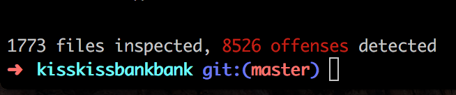
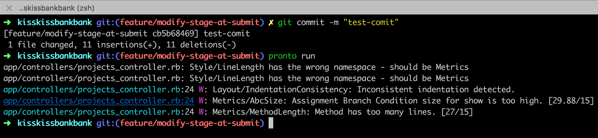

## Automatic code reviews with `Pronto`


---

## `RuboCop` in theory

 - Code without style error

 - Build a common codestyle thanks to `rubocop.yml`

---

## `RuboCop` in practice at KissKiss



---


---


---

## The `Pronto` gem

Executes `RuboCop` _only_ on the diffs between your branch and master

---

## install it

```bash
$ gem install pronto
$ gem install pronto-rubocop
$ gem install pronto-eslint
```

---

## Run it locally



 - no broken windows visible
 - reasonable number of offenses to deal with

---

## Still...

Frictions stay to build and share the codestyle

---

## github pr review
### setup 1/2

Create a `pronto.yml`:
```yml
github:
  slug: KissKissBankBank/kisskissbankbank
github_pr_review:
  format: "%{msg}"
max_warnings: 200
verbose: false
```

---

## github pr review
### setup 2/2

 - provide a Github `personal_access_token`

 - provide the `id` of the PR you want `Pronto` to review

---

## github pr review
### usage

```bash
$ pronto run -f github_pr_review
```

---


## How do we use it at kisskiss?


---


---


---

## Conclusion

---


