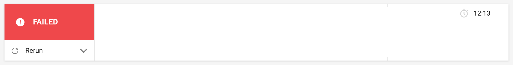
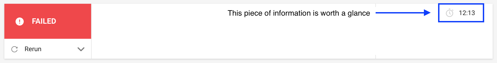

# Safepush

Augmenter la rapidité de votre feedback loop sur vos tests et sur votre lint

---

### Use case

Oftenly as a software developer, I guess you are confronted to this scenario :

Note:
 - Your tests fail on your remote branch after you push your branch

---

### Why does it matter ?

Note:
 - Now our problably telling yourself, ok, and so what ? (spéciale cassdédi à AnneSo)

---

### Let's have a look at the relevant information here

Note:
What does those 12ish min means ? Advice : this is a problem. To understand why, let's dig into the context:
 - It matters when you finished your development on your local codebase.

---

### Idea

Note:
- a note here

---

### Configuration

---

### Usage

---
