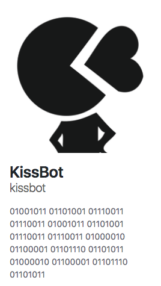

## Automatic code reviews with `Pronto`


Note:
Je vais rebondir sur des talks des deux derniers mois: celui d'Alexandre sur Rubocop, et le talk de Mehdi  sur le Circle CI.
---

## `RuboCop` in theory

 - Code without style error

 - Build a team custom codestyle with the `rubocop.yml`

Note:
A kkbb on adore la proposition de valeur de rubocop:
 - Faire en sorte que les devs ne fassent pas de fautes de style (rubocop relève alors des offenses)
 - Construire un codestyle partagé, propre à la boite (grâce au rubocop.yml)

---

## `RuboCop` in practice


Note:
Problème: Dans le contexte de Kisskiss, ces deux propositions sont cassées en pratique.
Il y a énormément d'offenses (du au fait qu'on a introduit tardivement rubocop sur un gros projet (~5ans))
le dev qui se retrouve face a toutes ses offenses est découragé d'aller chercher les siennes

La les deux propositions de valeurs sont cassés:
 - le dev est découragé d'aller chercher ses erreurs parmis toutes ces offenses (parfois elles sont perdues dans la console)
 -
---


Note:
plus pernicieux: Il y a un effet de broken window theory (cc Thibaut Asus). Puisqu'il y a tant d'erreurs, quelques unes de plus ne vont pas changer la donne.

---


Note:
Et dans le cas d'une appli ancienne c'est plusieurs windows qui sont cassées.
(on note que la rue s'appelle Travis)

---

## `Pronto`

Executes `RuboCop` _only_ on the diffs between your branch and master

Note:
Pour y remédier, on a implémenté un utilitaire: pronto.
  --> Qu'est ce que c'est pronto: Un utilitaire qui permet d'éxecuter rubocop UNIQUEMENT sur la diff entre la branche que vous avez tirée pour dev votre feature, et la branche source.

---

## installation

```bash
$ gem install pronto
$ gem install pronto-rubocop
$ gem install pronto-eslint
```

Note:

  --> Comment on l'installe ?  1: `gem install pronto`. 2: les adapters `gem install pronto-rubocop`,  `gem install pronto-eslint`

---

## Local run


 - no broken windows visible

 - reasonable number of offenses to deal with

Note:
La première c'est `pronto run`.  (img) Ca permet d'avoir la liste des offenses que l'on a introduites en local, sur la command line.
  --> On résoud la première proposition de valeur car
       - le dev est confronté à un nombre réduit d'offenses
       - Il ne voit pas les offenses des autres et donc ne subit pas le biais du broken window theory
 --> On résoud à moitié la deuxième proposition de valeur:
       - le dev peut se poser des questions sur les offenses qu'il n'arrive pas à résoudre automatiquement, et consulter les autres.

---

## Still.

Frictions remains for building the team codestyle

Note:
 - Servent à construire le styleguide de départ. Notre parti à Kisskiss a été de discuter de ses règles la pour que la team les partage.
  - On est pas dans un environement propice (ici le local) pour ce genre de discussions
  - Et même, si on a un doute sur comment résoudre une rêgle, il faut déranger quelqu'un pour avoir sa rep.

---

## github pr review

Comment directly the offenses raised on the Github pull request.

---

## github pr review

Create a `pronto.yml` file:
```yml
github:
  slug: YourOrg/YourRepo
github_pr_review:
  format: "%{msg}"
max_warnings: 200
verbose: false
```

Note:
La deuxième c'est pronto run github-pr-review.
 Qu'est ce que c'est
 - Ici, pronto va exécuter Rubocop sur la PR que l'on souhaite sur github, et mettre des commentaires dans la PR pour chaque offense qu'il trouve.
 - demande un poil plus de setup :

---

## github pr review

 - provide a Github `personal_access_token` (with repo rights)
```bash
$ PRONTO_GITHUB_ACCESS_TOKEN=********
```

 - provide the `id` of the PR you want `Pronto` to review
```bash
$ PULL_REQUEST_ID=10
```

Note:
- il faut passer à pronto le numéro de la PR que l'on souhaite analyser
- il faut passer ) pronto un token personnel GH avec des droits d'écritures sur les repos. (il utilise donc l'identité de la personne qui a généré le token pour faire des commentaires)

---

## github pr review
##### use it

```bash
$ pronto run -f github_pr_review -c origin/master
```

Note:
Pour le CI, on récupère toutes les PR, et on récupère la PR dont le dernier commit
est le commit analysé par le CI
---

## Meet the KissBot



Note:
A kisskiss, on a choisit de prendre l'identité de kissbot (le bot de la boite), (cc Sunny) pour faire ces PR. On a développé un éxecutable qui se lance lors du CI, ce qui
fait que à chaque ouverture de PR, Kissbot va commenter.

---


Note:
Kissbot à la base c'est un slackbot.
Kissbot est déjà assez connu dans la boite pour être un Farceur, du coup ca met plutôt
une bonne ambiance.
On a choisi de l'utiliser parce que ca évite que quelqu'un prenne le rôle de faire toutes les
remarques de style pas marrantes. Ca renverse meme parfois la tendance!

---


Note:
Ca règle les dernières propositions de valeur cassées :
- Soulevé publiquement et automatiquement --> Facile pour toi de poser une question sur comment résoudre l'erreur
- Si on est pas d'accord on peut rebondir et enclencher un débat qui va aboutir à mettre la règle dans le rubocop et le personnaliser.

---


Note:
Et comme on peut le voir, ca mène surtout à des discussions plus sérieuses, qui contribuent à forger notre codestyle.


---

## Conclusion

Note:
- Ca résoud complètement le pb de la dernière proposition de valeur: on supprime la friction sur les offenses conflictuelles, car il suffit pour tabler (en termes d'équipe) sur cette offense, de réagir directement sur le commentaire GH de pronto, et de laisser les autres réagir / review la PR.
--> pronto en local + github_pr_review, nous permet de profiter à fond de la proposition de valeur de rubocop.

Rubocop est un outil puissant, pour l'appliquer en pratique, pronto c'est l'utilitaire qu'il vous faut ;)

---


Note:
Rubocop dans le linter c'est bien mais ca résoud pas les pb suivant:
 - Etre dans un environement propice à générer une discussion pour construire un codestyle
 - Etre dans un environement propice pour demander des conseils pour résoudre les erreurs pas évidentes
 - C'est pratique pour le dev, mais pour la team ca peut même avoir un effet pernicieux:
    - on voit pas forcément les erreurs laissées passées par le dev, et pourquoi
 - Enfin ca surcharge l'éditeur (moi j'avais eslint que j'ai du abandonner par ex)
